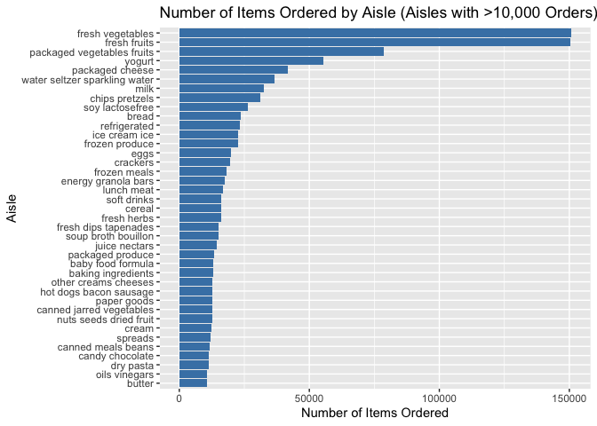
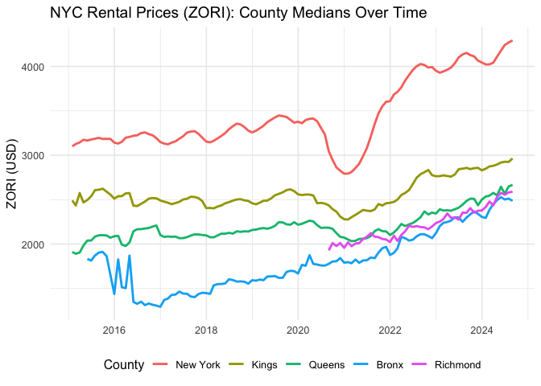
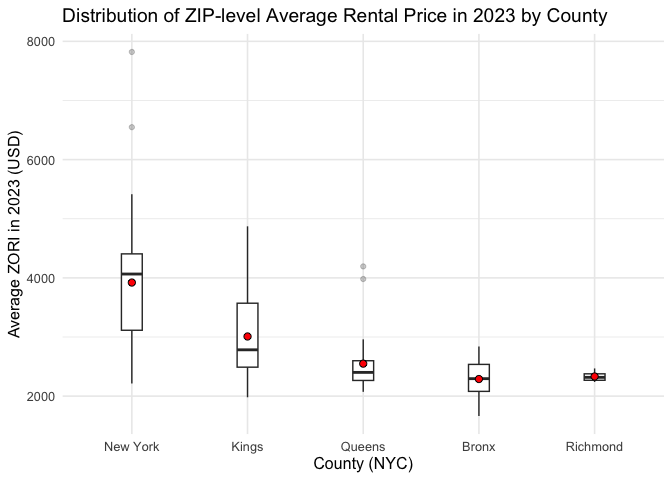
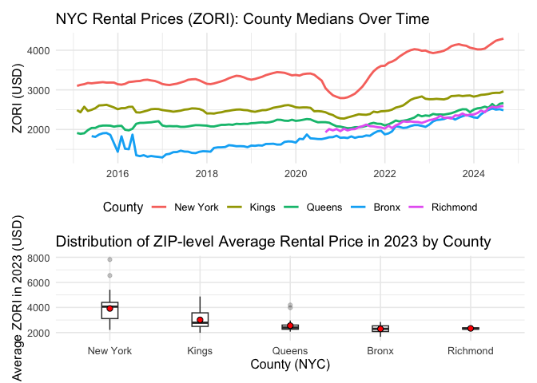
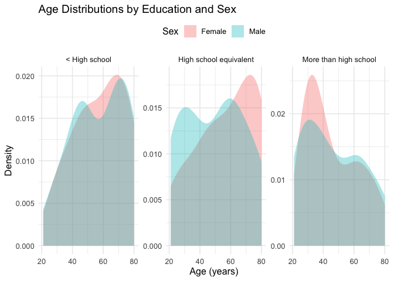
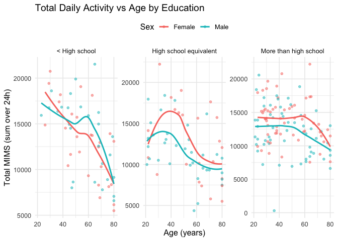
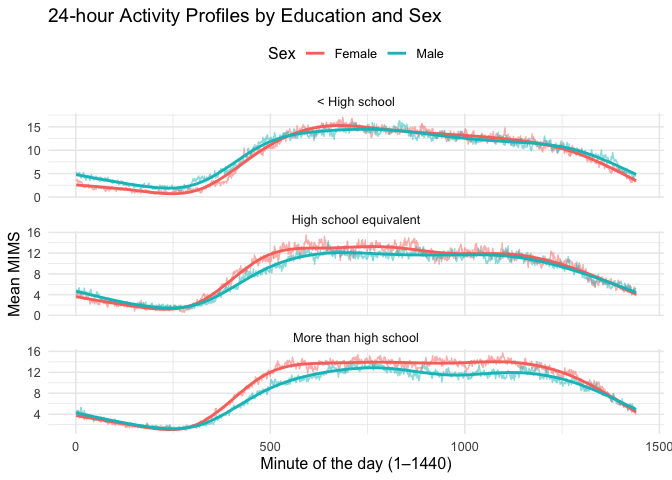

p8105_hw3_yc4804
================
Yilin Cai
2025-10-11

## Problem 1

``` r
library(p8105.datasets)
library(tidyverse)
```

    ## ── Attaching core tidyverse packages ──────────────────────── tidyverse 2.0.0 ──
    ## ✔ dplyr     1.1.4     ✔ readr     2.1.5
    ## ✔ forcats   1.0.0     ✔ stringr   1.5.1
    ## ✔ ggplot2   3.5.2     ✔ tibble    3.3.0
    ## ✔ lubridate 1.9.4     ✔ tidyr     1.3.1
    ## ✔ purrr     1.1.0     
    ## ── Conflicts ────────────────────────────────────────── tidyverse_conflicts() ──
    ## ✖ dplyr::filter() masks stats::filter()
    ## ✖ dplyr::lag()    masks stats::lag()
    ## ℹ Use the conflicted package (<http://conflicted.r-lib.org/>) to force all conflicts to become errors

``` r
data("instacart")
instacart
```

    ## # A tibble: 1,384,617 × 15
    ##    order_id product_id add_to_cart_order reordered user_id eval_set order_number
    ##       <int>      <int>             <int>     <int>   <int> <chr>           <int>
    ##  1        1      49302                 1         1  112108 train               4
    ##  2        1      11109                 2         1  112108 train               4
    ##  3        1      10246                 3         0  112108 train               4
    ##  4        1      49683                 4         0  112108 train               4
    ##  5        1      43633                 5         1  112108 train               4
    ##  6        1      13176                 6         0  112108 train               4
    ##  7        1      47209                 7         0  112108 train               4
    ##  8        1      22035                 8         1  112108 train               4
    ##  9       36      39612                 1         0   79431 train              23
    ## 10       36      19660                 2         1   79431 train              23
    ## # ℹ 1,384,607 more rows
    ## # ℹ 8 more variables: order_dow <int>, order_hour_of_day <int>,
    ## #   days_since_prior_order <int>, product_name <chr>, aisle_id <int>,
    ## #   department_id <int>, aisle <chr>, department <chr>

Dataset Description

The instacart dataset provides detailed information on grocery orders
placed through the Instacart app. It contains 1,384,617 observations
from 131,209 unique users, where each row represents a single product
from a user’s order. Each user contributes exactly one order in this
version of the dataset. There are 15 variables describing product
details, order timing, and categorical classifications such as aisle and
department. Key variables include: order_id: unique order identifier
product_id: unique product identifier user_id: customer identifier
product_name: name of the product aisle / department: product location
categories order_dow: day of the week order placed (0 = Sunday, 6 =
Saturday) order_hour_of_day: hour (0–23) when order was placed

``` r
#Question 1: number of aisles and most ordered from
aisle_summary = instacart %>%
  count(aisle, sort = TRUE)

n_aisles = nrow(aisle_summary)
top_aisles = head(aisle_summary, 5)

n_aisles
```

    ## [1] 134

``` r
top_aisles
```

    ## # A tibble: 5 × 2
    ##   aisle                           n
    ##   <chr>                       <int>
    ## 1 fresh vegetables           150609
    ## 2 fresh fruits               150473
    ## 3 packaged vegetables fruits  78493
    ## 4 yogurt                      55240
    ## 5 packaged cheese             41699

There are 134 aisles in total. The most ordered aisles include fresh
vegetables, fresh fruits, packaged vegetables fruits, yogurt, and
packaged cheese.

``` r
#Question2: Plot — Number of Items Ordered per Aisle (Aisles > 10,000 Orders)
aisle_summary %>%
  filter(n > 10000) %>%
  mutate(aisle = fct_reorder(aisle, n)) %>%
  ggplot(aes(x = aisle, y = n)) +
  geom_col(fill = "steelblue") +
  coord_flip() +
  labs(
    title = "Number of Items Ordered by Aisle (Aisles with >10,000 Orders)",
    x = "Aisle",
    y = "Number of Items Ordered"
  )
```

<!-- -->

``` r
#The most popular items in selected aisles
popular_items = instacart %>%
  filter(aisle %in% c("baking ingredients", "dog food care", "packaged vegetables fruits")) %>%
  group_by(aisle, product_name) %>%
  summarize(order_count = n()) %>%
  arrange(aisle, desc(order_count)) %>%
  slice_head(n = 3)
```

    ## `summarise()` has grouped output by 'aisle'. You can override using the
    ## `.groups` argument.

``` r
knitr::kable(popular_items, caption = "Top 3 Most Popular Items in Selected Aisles")
```

| aisle | product_name | order_count |
|:---|:---|---:|
| baking ingredients | Light Brown Sugar | 499 |
| baking ingredients | Pure Baking Soda | 387 |
| baking ingredients | Cane Sugar | 336 |
| dog food care | Snack Sticks Chicken & Rice Recipe Dog Treats | 30 |
| dog food care | Organix Chicken & Brown Rice Recipe | 28 |
| dog food care | Small Dog Biscuits | 26 |
| packaged vegetables fruits | Organic Baby Spinach | 9784 |
| packaged vegetables fruits | Organic Raspberries | 5546 |
| packaged vegetables fruits | Organic Blueberries | 4966 |

Top 3 Most Popular Items in Selected Aisles

``` r
#Question 4: Mean Hour of the Day Pink Lady Apples and Coffee Ice Cream are Ordered (by Day of Week)

mean_hour = instacart %>%
  filter(product_name %in% c("Pink Lady Apples", "Coffee Ice Cream")) %>%
  group_by(product_name, order_dow) %>%
  summarize(mean_hour = mean(order_hour_of_day)) %>%
  pivot_wider(
    names_from = order_dow,
    values_from = mean_hour
  )
```

    ## `summarise()` has grouped output by 'product_name'. You can override using the
    ## `.groups` argument.

``` r
colnames(mean_hour) = c("Product", "Sun", "Mon", "Tue", "Wed", "Thu", "Fri", "Sat")

knitr::kable(mean_hour, digits = 2, caption = "Mean Hour of Purchase by Day of Week")
```

| Product          |   Sun |   Mon |   Tue |   Wed |   Thu |   Fri |   Sat |
|:-----------------|------:|------:|------:|------:|------:|------:|------:|
| Coffee Ice Cream | 13.77 | 14.32 | 15.38 | 15.32 | 15.22 | 12.26 | 13.83 |
| Pink Lady Apples | 13.44 | 11.36 | 11.70 | 14.25 | 11.55 | 12.78 | 11.94 |

Mean Hour of Purchase by Day of Week

Pink Lady Apples are typically ordered earlier in the day (late morning
to early afternoon). Coffee Ice Cream is often ordered later in the day
(afternoon to evening). This pattern likely reflects typical consumption
timing—fresh fruit as part of meals versus dessert treats in the
evening.

## Problem 2

``` r
library(tidyverse)
library(lubridate)
library(patchwork)
library(knitr)

# paths
zori_path <- "/Users/caiyilin/Desktop/p8105_hw3_yc4804/zillow_data/Zip_zori_uc_sfrcondomfr_sm_month_NYC.csv"
map_path  <- "/Users/caiyilin/Desktop/p8105_hw3_yc4804/zillow_data/Zip Codes.csv"

zori_raw <- readr::read_csv(zori_path, show_col_types = FALSE, name_repair = "minimal")
zip_map  <- readr::read_csv(map_path,  show_col_types = FALSE)

# columns in your files
zip_col_zillow <- "RegionName"   # ZIP in Zillow file
zip_col_map    <- "ZipCode"      # ZIP in mapping file
boro_col_map   <- "County"       # USE ORIGINAL COUNTY — NO RECODING

# monthly columns like "YYYY-MM" or "YYYY-MM-DD"
date_cols <- names(zori_raw)[grepl("^\\d{4}-\\d{2}(-\\d{2})?$", names(zori_raw))]

# long format + parse date
zori_long <- zori_raw |>
  pivot_longer(all_of(date_cols), names_to = "month_header", values_to = "zori") |>
  mutate(
    date = ymd(month_header, quiet = TRUE),
    date = if_else(is.na(date), ym(month_header, quiet = TRUE), date),
    zip  = str_pad(.data[[zip_col_zillow]] |> as.character(), 5, pad = "0")
  ) |>
  select(zip, date, zori) |>
  filter(!is.na(date)) |>
  filter(date >= ymd("2015-01-01"), date <= ymd("2024-08-31")) |>
  mutate(year = year(date))

# attach ORIGINAL county labels; keep them in a column named "borough"
zip_map_small <- zip_map |>
  transmute(
    zip     = str_pad(.data[[zip_col_map]] |> as.character(), 5, pad = "0"),
    borough = .data[[boro_col_map]] |> as.character()     # <- original County values (e.g., Kings)
  )

zori_long <- zori_long |>
  left_join(zip_map_small, by = "zip") |>
  mutate(
    # optional: order by county names rather than borough names
    borough = factor(borough, levels = c("New York","Kings","Queens","Bronx","Richmond"))
  ) |>
  select(zip, date, zori, year, borough)
```

    ## Warning in left_join(zori_long, zip_map_small, by = "zip"): Detected an unexpected many-to-many relationship between `x` and `y`.
    ## ℹ Row 4757 of `x` matches multiple rows in `y`.
    ## ℹ Row 256 of `y` matches multiple rows in `x`.
    ## ℹ If a many-to-many relationship is expected, set `relationship =
    ##   "many-to-many"` to silence this warning.

``` r
view(zori_long)
```

``` r
#Q1: Coverage counts across Jan 2015–Aug 2024 (116 months)
coverage <- zori_long %>%
  mutate(has_obs = !is.na(zori)) %>%
  group_by(zip) %>%
  summarize(n_months = sum(has_obs), .groups = "drop")

n_full_116 <- sum(coverage$n_months == 116, na.rm = TRUE)
n_lt_10    <- sum(coverage$n_months < 10,  na.rm = TRUE)

cat("ZIPs observed 116 times:", n_full_116, "\n")
```

    ## ZIPs observed 116 times: 47

``` r
cat("ZIPs observed < 10 times:", n_lt_10, "\n")
```

    ## ZIPs observed < 10 times: 26

Some ZIP codes show up every month because they’re stable, residential
areas with enough active rental listings for Zillow to compute ZORI
continuously. ZIPs that appear only rarely are often PO-box or
non-residential ZIPs, newly created/retired or boundary-changed ZIPs, or
places with very sparse rental stock where values are suppressed or
can’t be reliably estimated. Occasional data gaps or insufficient
listings in particular months can also produce spotty coverage.

``` r
#Q2) Reader-friendly table: average rental price by county*year
library(knitr)

avg_boro_year <- zori_long |>
  filter(!is.na(zori), !is.na(borough)) |>
  group_by(borough, year) |>
  summarise(mean_zori = round(mean(zori, na.rm = TRUE), 0), .groups = "drop") |>
  mutate(borough = factor(borough, levels = c("New York","Kings","Queens","Bronx","Richmond"))) |>
  arrange(borough, year) |>
  tidyr::pivot_wider(names_from = year, values_from = mean_zori)

kable(avg_boro_year, caption = "Average ZORI ($) by County and Year", align = "c")
```

| borough  | 2015 | 2016 | 2017 | 2018 | 2019 | 2020 | 2021 | 2022 | 2023 | 2024 |
|:--------:|:----:|:----:|:----:|:----:|:----:|:----:|:----:|:----:|:----:|:----:|
| New York | 3006 | 3015 | 3109 | 3160 | 3285 | 3091 | 3124 | 3753 | 3908 | 4053 |
|  Kings   | 2493 | 2520 | 2546 | 2547 | 2631 | 2555 | 2550 | 2868 | 3015 | 3126 |
|  Queens  | 2215 | 2272 | 2263 | 2292 | 2388 | 2316 | 2211 | 2406 | 2562 | 2694 |
|  Bronx   | 1760 | 1520 | 1544 | 1639 | 1706 | 1811 | 1858 | 2054 | 2285 | 2497 |
| Richmond |  NA  |  NA  |  NA  |  NA  |  NA  | 1978 | 2045 | 2147 | 2333 | 2536 |

Average ZORI (\$) by County and Year

The table shows a clear and persistent price gradient: New York
(Manhattan) is highest every year, followed by Kings (Brooklyn), then
Queens, with Bronx and Richmond (Staten Island) lowest. All boroughs dip
or flatten around 2020–2021 (pandemic period) and then rebound strongly
in 2022–2024, with Manhattan surpassing \$4,000 by 2024. Brooklyn and
Queens also rise to new highs by 2024, while Bronx and Richmond increase
more modestly and remain below the citywide leaders. Richmond is missing
earlier years (coverage gap) but, where observed (2020+), tracks just
above the Bronx and below Queens.

``` r
#Q3) Plot: NYC rental prices over time (facilitates county comparisons)
library(ggplot2)

# Use monthly county medians for clarity with many ZIPs
boro_month_median <- zori_long |>
  filter(!is.na(zori), !is.na(borough)) |>
  group_by(borough, date) |>
  summarise(median_zori = median(zori, na.rm = TRUE), .groups = "drop") |>
  mutate(borough = factor(borough, levels = c("New York","Kings","Queens","Bronx","Richmond")))

p1 <- ggplot(boro_month_median, aes(date, median_zori, color = borough)) +
  geom_line(linewidth = 1) +
  labs(
    title = "NYC Rental Prices (ZORI): County Medians Over Time",
    x = NULL, y = "ZORI (USD)", color = "County"
  ) +
  theme_minimal(base_size = 12) +
  theme(legend.position = "bottom")

p1
```

<!-- -->

The time-series makes the borough gradient unmistakable: New York
(Manhattan) is highest throughout, Kings (Brooklyn) next, then Queens,
with Bronx and Richmond (Staten Island) lowest. All five show a pandemic
dip around 2020–2021, most pronounced in Manhattan, followed by a strong
rebound from 2022 onward—Manhattan surpasses \$4k by 2024 while others
also reach new highs. Richmond enters later (coverage begins around
2021) and tracks just above the Bronx. Early volatility in the Bronx
likely reflects sparse ZIP coverage; otherwise the series are smooth and
clearly separated, facilitating cross-borough comparison.

``` r
#Q4) 2023 ZIP-level averages + distribution plot across counties
county_order <- c("New York","Kings","Queens","Bronx","Richmond")

zip_2023_avg <- zori_long %>%
  filter(year == 2023, !is.na(zori), !is.na(borough)) %>%
  group_by(borough, zip) %>%
  summarise(avg_2023 = mean(zori, na.rm = TRUE), .groups = "drop") %>%
  mutate(borough = factor(borough, levels = county_order))

# Reader-friendly distribution plot across boroughs
p_zip_dist_2023 <- ggplot(zip_2023_avg, aes(borough, avg_2023)) +
  geom_boxplot(width = 0.18, outlier.alpha = 0.25) +
  stat_summary(fun = "mean", geom = "point", shape = 21, size = 2.2, fill = "red")  +
  labs(
    title = "Distribution of ZIP-level Average Rental Price in 2023 by County",
    x = "County (NYC)",
    y = "Average ZORI in 2023 (USD)"
  ) +
  theme_minimal(base_size = 12) +
  theme(legend.position = "none")

p_zip_dist_2023
```

<!-- -->

The 2023 ZIP-level distributions line up as expected: New York
(Manhattan) is highest and most variable, with a wide IQR and several
high outliers (\> \$6k–\$7k). Kings (Brooklyn) sits next with a moderate
spread, followed by Queens in the mid-\$2k range with a tighter IQR but
a few high outliers (~\$4k). Bronx and Richmond (Staten Island) are
lowest; Richmond’s box is especially narrow, suggesting little
within-county variation (and/or fewer ZIPs). Overall, both the level and
the spread of rents decline as you move from Manhattan → Brooklyn →
Queens → Bronx/Richmond.

``` r
#Q5: combine two plots
dir.create("problem 2 results", showWarnings = FALSE)
library(patchwork)

combined <- p1 /p_zip_dist_2023 + plot_layout(heights = c(2, 1.3))
combined
```

<!-- -->

``` r
ggsave("problem 2 results/combined_plots.png", combined, width = 10, height = 10, dpi = 300)
ggsave("problem 2 results/zori_county_median_over_time.png", p1, width = 10, height = 6, dpi = 300)
ggsave("problem 2 results/zori_2023_zip_distribution_by_county.png", p_zip_dist_2023, width = 9, height = 5, dpi = 300)

cat("Saved to problem 2 results/: combined_plots.png, zori_county_median_over_time.png, zori_2023_zip_distribution_by_county.png\n")
```

    ## Saved to problem 2 results/: combined_plots.png, zori_county_median_over_time.png, zori_2023_zip_distribution_by_county.png

## Problem 3

``` r
library(tidyverse)
library(janitor)
```

    ## 
    ## Attaching package: 'janitor'

    ## The following objects are masked from 'package:stats':
    ## 
    ##     chisq.test, fisher.test

``` r
library(lubridate)
library(hms)
```

    ## 
    ## Attaching package: 'hms'

    ## The following object is masked from 'package:lubridate':
    ## 
    ##     hms

``` r
accel_path <- "/Users/caiyilin/Desktop/p8105_hw3_yc4804/problem_3_data/nhanes_accel.csv"  
covar_path <- "/Users/caiyilin/Desktop/p8105_hw3_yc4804/problem_3_data/nhanes_covar.csv"   

accel_raw <- readr::read_csv(accel_path, show_col_types = FALSE)
covar_raw <- readr::read_csv(
  "/Users/caiyilin/Desktop/p8105_hw3_yc4804/problem_3_data/nhanes_covar.csv",
  skip = 4,                 # <- use the 5th row as the header
  show_col_types = FALSE
)

# ---- Recode demographics with reasonable classes ----
covar <- covar_raw |>
  mutate(
    # sex: 1 = male, 2 = female (from your legend)
    sex = case_when(
      sex == 1 ~ "Male",
      sex == 2 ~ "Female",
      TRUE ~ NA_character_
    ),
    sex = factor(sex, levels = c("Female", "Male")),

    # age numeric integer
    age = as.integer(age),

    # bmi numeric
    BMI = as.numeric(BMI),

    # education: 1 < HS, 2 HS equivalent, 3 > HS  (ordered)
    education = case_when(
      education == 1 ~ "< High school",
      education == 2 ~ "High school equivalent",
      education == 3 ~ "More than high school",
      TRUE ~ NA_character_
    ),
    education = factor(education,
                       levels = c("< High school", "High school equivalent", "More than high school"),
                       ordered = TRUE)
  )

# ---- Exclude: age < 21, AND any missing demographic values ----
demo_cols <- c("sex","age","BMI","education")
covar_clean <- covar |>
  drop_na(all_of(demo_cols)) |>
  filter(age >= 21)

# ---- Tidy accelerometer to long: one row per person–minute ----
minute_cols <- names(accel_raw)[stringr::str_detect(names(accel_raw), "^min\\d+$")]

accel_long <- accel_raw |>
  select(SEQN, all_of(minute_cols)) |>
  pivot_longer(
    cols = all_of(minute_cols),
    names_to  = "minute_var",     # e.g., "min537"
    values_to = "MIMS"
  ) |>
  mutate(
    minute     = readr::parse_number(minute_var),   # 1..1440
    .after = SEQN
  ) |>
  select(-minute_var)

# ---- Merge (inner join = participants present in both) ----
nhanes_long <- accel_long |>
  inner_join(covar_clean, by = "SEQN") |>
  arrange(SEQN, minute)

view(nhanes_long)

# Objects you can use:
#   nhanes_long: tidy dataset with columns
#     seqn, minute, time_of_day, mims, sex, age, bmi, education
```

``` r
#Question 1: Table: men/women per education + age distributions by sex within education
library(dplyr)
library(ggplot2)
library(knitr)

## Counts table (reader-friendly)
sex_ed_counts <- nhanes_long %>%
  distinct(SEQN, sex, education) %>%     # one row per participant
  count(education, sex) %>%
  tidyr::pivot_wider(names_from = sex, values_from = n, values_fill = 0) %>%
  arrange(education)

kable(sex_ed_counts,
      caption = "Number of Men and Women by Education Category",
      align = "c")
```

|       education        | Female | Male |
|:----------------------:|:------:|:----:|
|     \< High school     |   28   |  27  |
| High school equivalent |   23   |  35  |
| More than high school  |   59   |  56  |

Number of Men and Women by Education Category

``` r
## Age distributions (density) by sex within education
age_dist <- nhanes_long %>%
  distinct(SEQN, age, sex, education) %>%
  mutate(education = droplevels(education))

ggplot(age_dist, aes(x = age, fill = sex)) +
  geom_density(alpha = 0.35, adjust = 1.0, color = NA) +
  facet_wrap(~ education, nrow = 1, scales = "free_y") +
  scale_fill_discrete(name = "Sex") +
  labs(title = "Age Distributions by Education and Sex",
       x = "Age (years)", y = "Density") +
  theme_minimal(base_size = 12) +
  theme(legend.position = "top")
```

<!-- -->

A quick read of the figure shows clear age shifts across education
levels. In the \< high school group, both men and women skew older, with
most density in the late 60s–70s. The high school equivalent group is
broader; men look slightly bimodal (30s and 60s), while women lean older
(mid-50s to 70s). In more than high school, women skew younger with a
prominent peak in the 30s, whereas men are more evenly spread into later
adulthood. Despite these shifts, the sexes overlap substantially within
each education category.

``` r
# Question 2: Total activity per participant
## Total activity = sum of minute-level MIMS across the day (per participant)
total_activity <- nhanes_long %>%
  group_by(SEQN, sex, age, education) %>%
  summarise(total_mims = sum(MIMS, na.rm = TRUE), .groups = "drop")

## Scatter + smooth (compare men vs women; separate panels by education)
ggplot(total_activity, aes(x = age, y = total_mims, color = sex)) +
  geom_point(alpha = 0.5, size = 1.3) +
  geom_smooth(se = FALSE, method = "loess", span = 0.9) +
  facet_wrap(~ education, nrow = 1, scales = "free_y") +
  scale_color_discrete(name = "Sex") +
  labs(title = "Total Daily Activity vs Age by Education",
       x = "Age (years)", y = "Total MIMS (sum over 24h)") +
  theme_minimal(base_size = 12) +
  theme(legend.position = "top")
```

    ## `geom_smooth()` using formula = 'y ~ x'

<!-- -->

Total daily activity generally declines with age across all education
groups, with the steepest drop after about 65–70 years. In the \< high
school panel, both sexes show a strong negative age trend, and activity
converges to low levels in older ages. For the high school equivalent
group, women display a midlife peak (≈35–45) and remain above men
through mid-age; both sexes then fall toward ~10k MIMS by late
adulthood. In the more than high school group, activity is relatively
high and flat through ~30–60 (women slightly higher on average) before
declining in older ages; variability is larger at younger ages. Overall,
sex differences are modest but tend to favor women in midlife, while
education seems associated with higher and more stable activity before
old age.

``` r
#Question 3: 24-hour activity time courses

## Aggregate minute profiles for clarity (mean or median across people)
minute_profiles <- nhanes_long %>%
  group_by(education, sex, minute) %>%
  summarise(mean_mims = mean(MIMS, na.rm = TRUE), .groups = "drop")

## Smooth time courses by education, color by sex
ggplot(minute_profiles, aes(x = minute, y = mean_mims, color = sex)) +
  geom_line(alpha = 0.5) +
  geom_smooth(se = FALSE, span = 0.1, linewidth = 1) +
  facet_wrap(~ education, ncol = 1, scales = "free_y") +
  scale_color_discrete(name = "Sex") +
  labs(title = "24-hour Activity Profiles by Education and Sex",
       x = "Minute of the day (1–1440)", y = "Mean MIMS") +
  theme_minimal(base_size = 12) +
  theme(legend.position = "top")
```

    ## `geom_smooth()` using method = 'gam' and formula = 'y ~ s(x, bs = "cs")'

<!-- -->

Across all education groups, activity is near zero overnight, ramps up
sharply around minute ~300–400 (~5–7am), reaches a broad midday plateau
around minute ~600–900 (~10am–3pm), and then tapers into the evening.
The education gradient is clear: those with more than high school show
the highest daytime levels and the steepest morning rise, while the \<
high school group has a lower plateau and earlier evening decline. Sex
differences are modest—women tend to be slightly higher through the
midday period in the High school-equivalent and \>High school panels,
with little separation in the \<High school panel. Overall, the diurnal
shape is consistent, but the amplitude of activity increases with
education.
